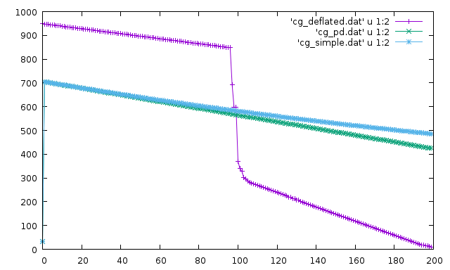

# CGDeflated

This program implements the solution of the Laplacecian in 1D using the Deflated Conjugate Gradient Algorithm.

The CG with Diagonal Preconditioner and Deflated by Guillaume Houzeaux

The solution with a few number of iterations for the CG algorithms

The residual versus the number of iterations for the CG algorithms

